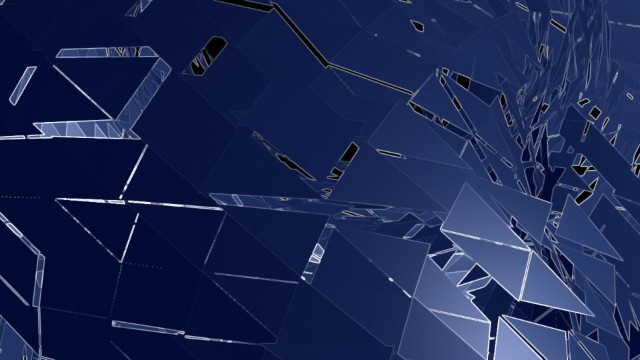
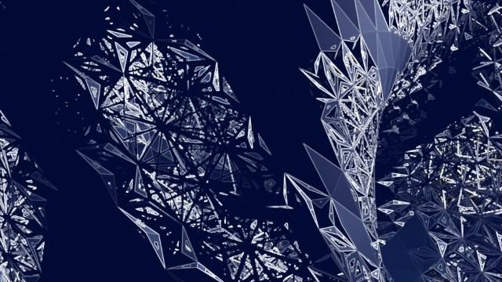

# SPEKTRA 4.0.0
This repo contains materials used in workshop **[SPEKTRA Vol.4.0.0 : Programming GPU based real-time graphics with TouchDesigner](4.0.0https://mtrl.com/kyoto/events/180520_touchdesigner-workshop/)** and refined after this WS.

## Theme: How to program Geometry Shader in TouchDesigner.
This WS focuses on Geometry Shader programming so we have to understand not only language spec but also how to pass infos defined in OpenGL rendering process such like vertex indexing or VBO attributes and so on. `DeformGeom.toe` contains 2 scenes under `/project1/` container and the former gives premise knowledge.

### 1. about_rendering

This scene is dedicated for explanation of how TouchDesigner handles OpenGL vertex specification with visual materials.

### 2. shader_experiminets

This scene has one `Render TOP` and one `Geometry COMP` and 6 `GLSL MAT`s to attach one by one. These shaders shows the idea how we can develop nice complexity in Geometry Shader programming (which means manupulation of the "polygons" stage)

* flat_phong: flat & phong shading in FS

* deform0: push up polygons by noise in GS

* deform1: polygon subdivision & push up in GS

* deform2: polygon subdivision & push up & frame
* deform3: repeated frame by mod
* deform4: looped (fractal-like) subdivision & pushed up & frame

